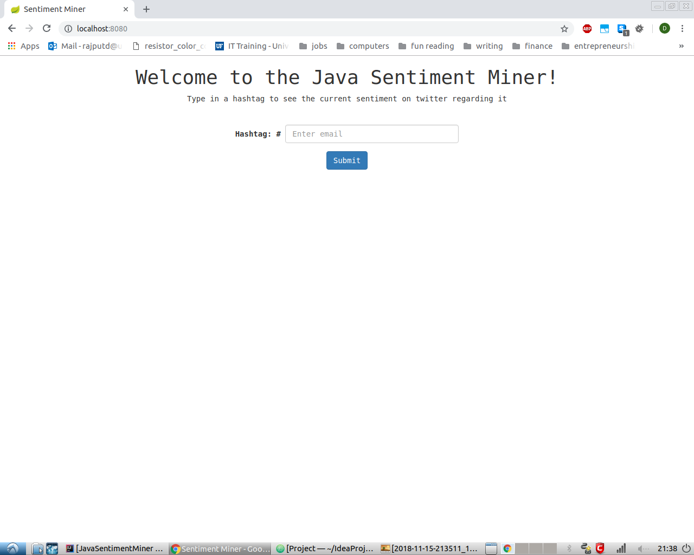
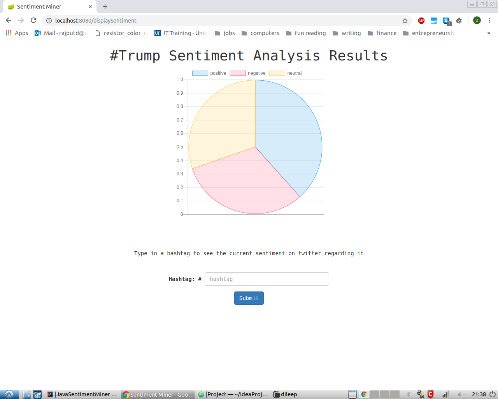

# Java-Sentiment-Miner

## Description

The Java Sentiment Miner is a web application that mines Tweets from Twitter and analyzes them for sentiment. Users can enter a hashtag into the application and receive a pie chart of how many of the associated Tweets are positive, negative, or neutral.

## requirements

1. [Twitter API Account](https://developer.twitter.com/en/apply-for-access)
2. [Gradle](https://gradle.org/)

## Installation

1. Clone the project into your desired location.

2. Login to your Twitter API account and navigate to Apps. Select the **App** option. Fill out the forum that appears and click the **create App** button.

3. Go to the **details** page of your newly created Twitter app. Navigate to **permissions** and set **access permissions** to **read-only**.

4. Navigate to the **keys and tokens** section of your Twitter app. Generate your **Consumer API keys** and your **Access Tokens**. Copy the resulting keys into the **twitter4j.properties** file in the project.

5. Place a positive and negative word lexicon in the src/main/resources/lexicons folder. If you do not have a set of lexicons you would like to use then you may choose to use the [Liu and Hu Opinion lexicon](https://www.cs.uic.edu/~liub/FBS/sentiment-analysis.html) that is provided in the lexicon folder. Get the absolute paths of of your chosen lexicons and paste them into the **config.properties** file.

6. build the gradle project.

7. Your project is now ready to go!

## Usage

### Starting the application

1. Run the Application class in src/main/java/app/ to start the web server at `localhost:8080`.

2. Navigate to `localhost:8080` to use the application. If you see the image below then everything is working.

### Using the application

On every page of this app you can submit a hashtag into a form and be redirected to a page displaying the associated sentiment data. The results look like the image below.

